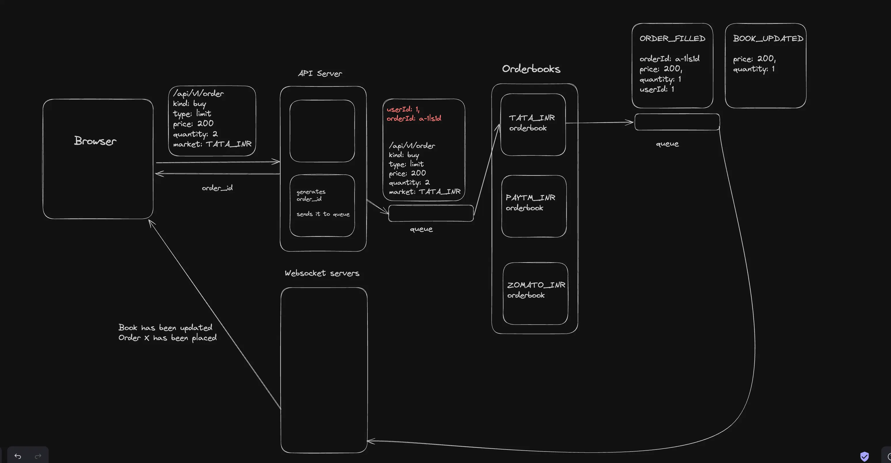
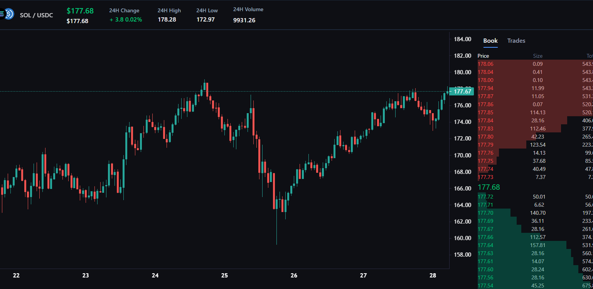

# Xchange 💱

**Xchange** is a distributed trading platform with modular architecture.
Each component (frontend, backend, engine, db) is hosted in a separate repository for scalability and independent development.

## 🔗 Repositories
- [Frontend (Next.js)](https://github.com/Thisshonrobert/exchange_frontend)
- [Backend ](https://github.com/Thisshonrobert/exchange_api)
- [Trading Engine (bun.js, Redis)](https://github.com/Thisshonrobert/exchange-engine)
- [Ws REAL TIME updates (bun.js, Redis)](https://github.com/Thisshonrobert/exchange-ws)
- [TimeScale Db ](https://github.com/Thisshonrobert/exchange-db)
- [MarketMaker](https://github.com/Thisshonrobert/market_maker_exchange)

## 🏗️ Architecture Overview

## 🏗️ Main Page  Overview

NOTE: Refer README.MD of individual folder .